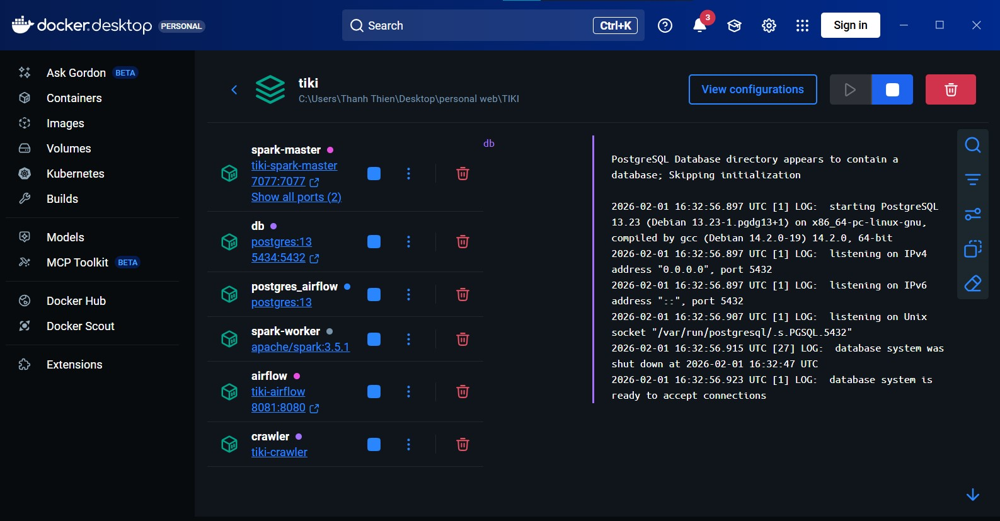
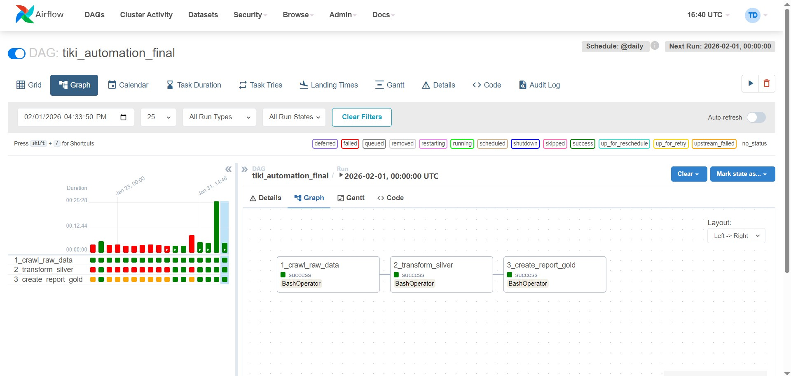

# End-to-End E-commerce Data Pipeline (Tiki.vn)


## 📖 Introduction

This project implements a scalable, automated **ETL Data Pipeline** to extract, transform, and load (ETL) e-commerce product data from **Tiki.vn** (one of Vietnam's largest online marketplaces).

The system follows the **Medallion Architecture** (Bronze/Silver/Gold layers) to ensure data quality and supports advanced analytics regarding **Pricing Strategy**, **Sales Performance**, and **Product Quality**.

## 🏗️ Architecture & Features

The pipeline is fully containerized using Docker and orchestrated by Apache Airflow.

### Key Features:
* **Medallion Architecture:**
    * 🥉 **Bronze:** Raw data ingestion from Tiki API to AWS S3.
    * 🥈 **Silver:** Data cleaning, deduplication, and schema enforcement using **PySpark**.
    * 🥇 **Gold:** Business-level aggregation (Revenue, Price Segments, Trust Score) stored in **PostgreSQL**.
* **Orchestration:** Airflow DAGs schedule and manage dependencies between Crawler, Spark Jobs, and Database loading.
* **Monitoring:** Custom `JobMonitor` tracks execution time and data quality (error rates).
* **CI/CD:** Integrated **GitHub Actions** for automated code quality checks.

## 📸 Project Screenshots

### 1. System Health (Docker Containers)
*Fully containerized environment running Spark Master/Worker, Airflow Scheduler/Webserver, and PostgreSQL.*



### 2. Orchestration (Apache Airflow)
*DAG execution flow: Crawl -> Bronze -> Silver -> Gold Analytics. All tasks executed successfully.*



## 🛠️ Tech Stack

* **Language:** Python, SQL.
* **Processing Engine:** Apache Spark (PySpark).
* **Orchestration:** Apache Airflow.
* **Containerization:** Docker, Docker Compose.
* **Storage:** AWS S3 (Data Lake), PostgreSQL (Data Warehouse).
* **DevOps:** GitHub Actions (CI/CD).

## 📂 Project Structure

```bash
├── app/                  # Python Crawler Source Code
│   ├── main.py           # Crawler Entrypoint
│   └── tiki_api.py       # API Handling
├── dags/                 # Airflow DAGs
│   └── tiki_pipeline.py  # Main DAG Definition
├── spark_jobs/           # PySpark Transformation Scripts
│   ├── bronze_to_silver.py
│   └── silver_to_gold_analytics.py # Business Logic & Analytics
├── utils/                # Shared Utilities
│   └── job_monitor.py    # Custom Monitoring Class
├── docker-compose.yml    # Infrastructure Setup
└── requirements.txt      # Python Dependencies
🏃‍♂️ How to Run
Prerequisites
Docker & Docker Compose installed.

An AWS Account (S3 Bucket & Keys).

Installation
Clone the repository:

Bash
git clone [https://github.com/vanthanhthien/Pipeline_Tiki.git](https://github.com/vanthanhthien/Pipeline_Tiki.git)
cd Pipeline_Tiki
Configure Environment: Create a .env file in the root directory (based on .env.example):

Đoạn mã
AWS_ACCESS_KEY_ID=your_key
AWS_SECRET_ACCESS_KEY=your_secret
AWS_BUCKET_NAME=your_bucket_name
DB_USER=admin
DB_PASS=admin123
Start Services:

Bash
docker-compose up -d --build
Access Interfaces:

Airflow UI: http://localhost:8081 (User/Pass: admin/admin)

Spark Master: http://localhost:8080

Postgres: localhost:5434

🔮 Future Roadmap
[ ] Build a visualization Dashboard using Power BI or Apache Superset.

[ ] Add Unit Tests for Spark Transformations.

[ ] Optimize Spark memory usage for larger datasets.